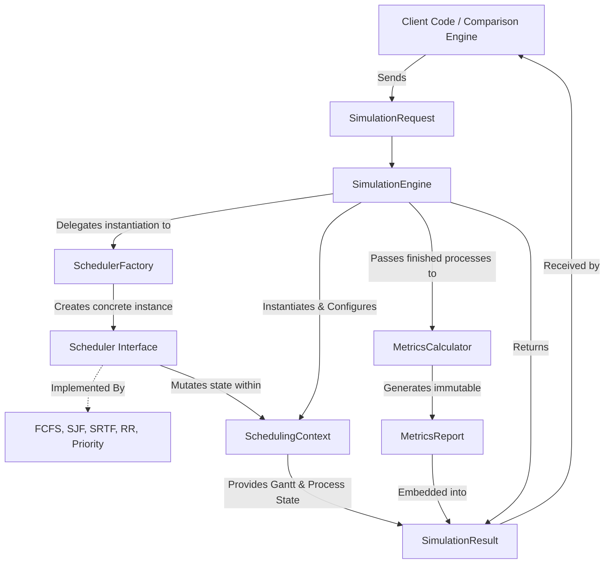

# Schedulix High-Level Architecture

The following diagram illustrates the high-level orchestration flow and structural dependencies between the core components of the Schedulix framework. It highlights the strict separation of concerns between state management (`SchedulingContext`), math calculation (`MetricsCalculator`), and actual algorithmic logic (`Scheduler`).

