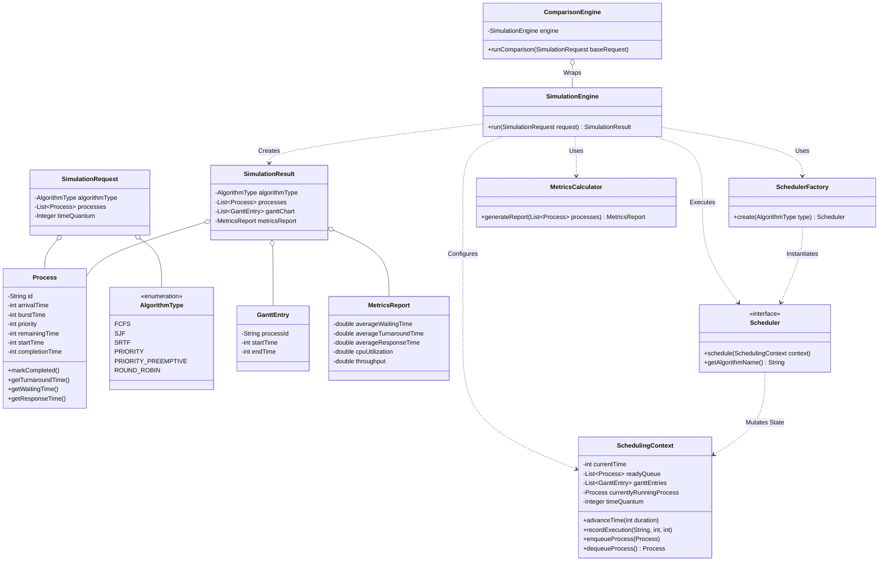

# Schedulix Class Diagram

This class diagram illustrates the domain models (DTOs), the strategy interfaces, and the core structural relationships that enforce the Single Responsibility and Dependency Inversion principles throughout the Schedulix framework.

