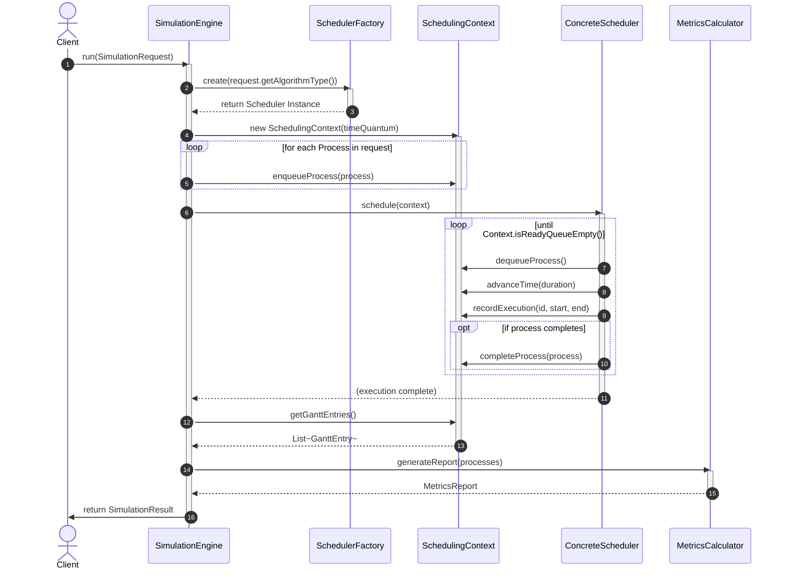

# Schedulix Sequence Diagram

This sequence diagram illustrates the exact chronological execution flow of a single simulation request, from the moment it is received by the `SimulationEngine` to the final return of the immutable `SimulationResult`.

